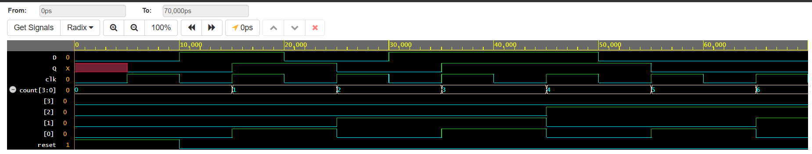

# Flip-Flop-and-counter-Build# CODETECH_TASK4

### Project Overview

This project implements a D Flip-Flop and a 4-Bit Up Counter using Verilog HDL. The D Flip-Flop is a fundamental sequential logic circuit used for storing one bit of data, while the 4-Bit Up Counter counts upward on every positive edge of the clock signal. Both circuits are essential components in digital systems and VLSI design. The designs were simulated and verified using EDA Playground and EPWave.

---

## Objectives

- Design a D Flip-Flop using Verilog HDL.
- Design a 4-Bit Up Counter using Verilog HDL.
- Verify the functionality through simulation and waveform analysis.
- Understand sequential logic circuits and clock-driven digital systems used in VLSI design.

---

## Tools Used

- Verilog HDL
- EDA Playground
- EPWave
- GitHub

---

## Project Files

- `design.v.txt` – Verilog module implementing the D Flip-Flop and 4-Bit Up Counter.
- `testbench.v.txt` – Testbench for simulating the Flip-Flop and Counter.
- `waveform.png` – Simulation waveform of the Flip-Flop and Counter.

---

## Functional Description

### D Flip-Flop

| Clock Edge | D | Q (Next State) |
|------------|---|----------------|
| Rising Edge | 0 | 0 |
| Rising Edge | 1 | 1 |

### 4-Bit Up Counter

| Clock Pulse | Counter Output |
|--------------|----------------|
| Reset | 0000 |
| 1 | 0001 |
| 2 | 0010 |
| 3 | 0011 |
| 4 | 0100 |
| 5 | 0101 |
| 6 | 0110 |
| 7 | 0111 |

---

## Simulation Results

The simulation successfully verified the operation of both the D Flip-Flop and the 4-Bit Up Counter. The D Flip-Flop correctly stored the input data on every rising edge of the clock, while the counter incremented its value with each clock pulse after reset. The generated waveform in EPWave confirmed the correct sequential behavior of both circuits.

---

## Waveform

### Flip-Flop and Counter Waveform

---

## Conclusion

This project demonstrates the design and simulation of two fundamental sequential logic circuits: a D Flip-Flop and a 4-Bit Up Counter using Verilog HDL. Both circuits were successfully verified through simulation using EDA Playground and waveform analysis using EPWave. The project provides practical understanding of sequential logic, clock-driven circuit operation, data storage, and counting mechanisms, strengthening essential VLSI and digital design concepts.
